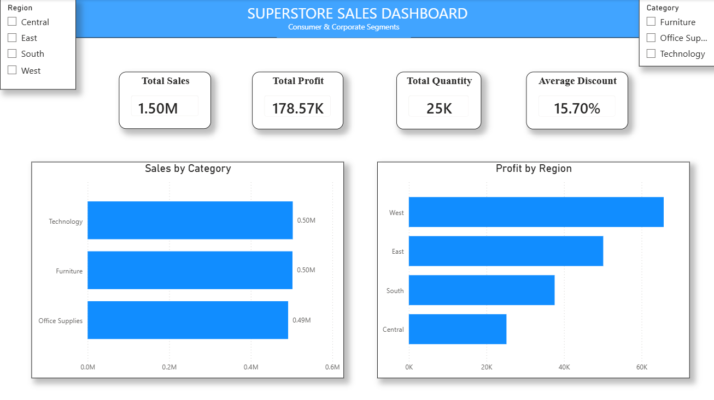

# 📊 Superstore Sales Dashboard (Power BI)

An interactive Power BI dashboard built to analyze Superstore sales performance using KPIs, charts, filters, and business intelligence techniques.

---

## 📌 About This Project

This dashboard provides an interactive overview of Superstore sales data, enabling users to monitor business performance through dynamic visualizations and KPIs.

The project demonstrates data analysis and dashboard development using Microsoft Power BI.

---

## 🎯 Dashboard Features

### 📈 KPI Cards

- Total Sales
- Total Profit
- Total Quantity
- Average Discount

### 🎛 Interactive Filters

- Region
- Category

### 📊 Visualizations

- Sales by Category
- Profit by Region
- Interactive KPI Cards
- Dynamic Dashboard Filtering

---

## 📂 Files Included

- `PR1.pbix` → Power BI Dashboard File
- `Sample - Superstore.csv` → Dataset
- `Dashboard_Output.png` → Dashboard Screenshot

---

## 🛠 Tools & Technologies

- Microsoft Power BI
- Power Query
- DAX
- CSV Dataset
- Data Modeling
- Business Intelligence

---

## 📈 Key Insights

- Region-wise profit comparison
- Category-wise sales performance
- Overall sales KPIs
- Average discount analysis
- Interactive business reporting

---

## 📚 Learning Outcomes

This project helps in understanding:

- Power BI Dashboard Design
- KPI Development
- DAX Fundamentals
- Data Visualization
- Business Intelligence
- Interactive Reporting

---

## 📸 Dashboard Preview

---

## 👨‍💻 Author

**Yashraj Sharma**

BCA Graduate | Aspiring AI/ML Engineer | Python • SQL • Power BI • Data Science

---

⭐ If you like this project, don't forget to star the repository.
